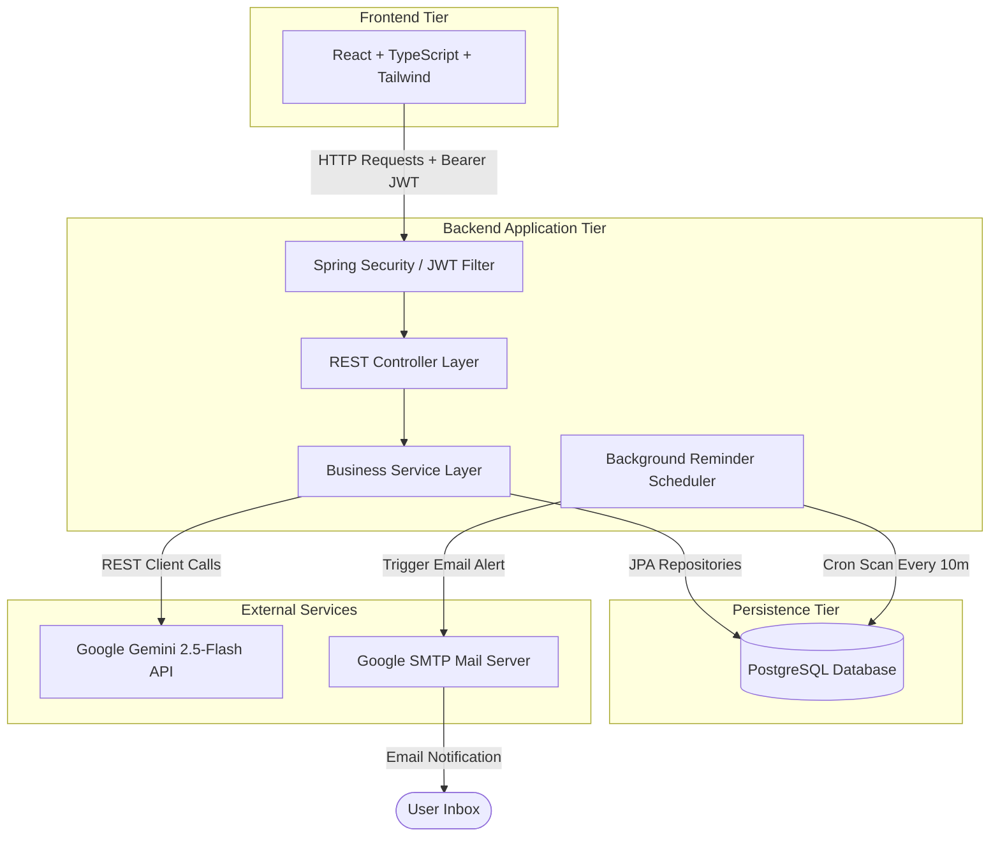
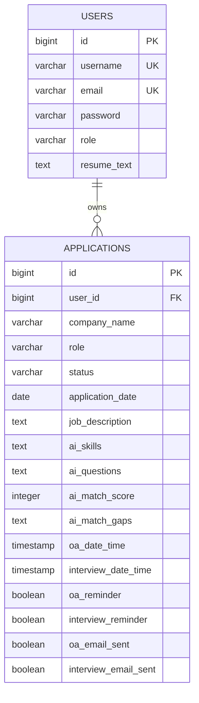
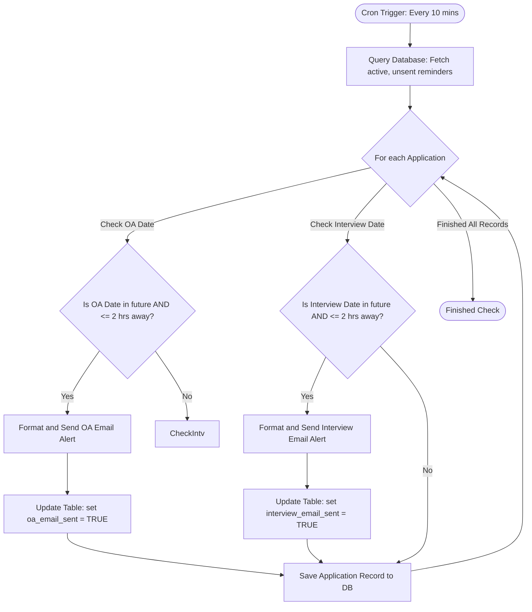

# 💼 Internship & Placement Tracker (AI-Powered)

An advanced, full-stack monorepo application designed to track placement opportunities, schedule Online Assessments (OA) / Interviews with automated email reminders, and analyze job specifications using AI.

---

## 🌟 Core Features

*   **🔒 JWT User Authentication:** Secure register and login interfaces with BCrypt password encryption and stateless JSON Web Token validations.
*   **📋 Placement CRUD Workspace:** Add, edit, search, filter, and delete application records dynamically.
*   **🔮 Gemini AI Insights Drawer:**
    *   *Skill Extractor:* Auto-parses job descriptions to identify required frameworks, languages, and tools.
    *   *Practice Coach:* Generates exactly 5 tailored interview questions based on the role and company.
    *   *Resume Matcher:* Evaluates your resume highlights against the job description to output compatibility metrics and skill gaps.
*   **⚡ Database AI Caching:** Caches AI outcomes directly in Postgres to optimize performance, load drawer tabs under 10ms, and protect Gemini API quotas.
*   **🔔 Countdown Reminders & Email Alerts:**
    *   Conditionally renders date-time fields when status is set to *OA Received* or *Interview Scheduled*.
    *   Live header countdown ticker (e.g. `2d 5h left`).
    *   Background database cron scanning every 10 minutes to dispatch warning emails when events are $\le$ 2 hours away.
*   **📊 Dynamic KPI Cards:** Real-time metrics calculations (Total Apps, OA Conversion, and Interview Success Rates).

---

## 🛠️ Technology Stack

*   **Frontend:** React (Vite 5), TypeScript, Tailwind CSS, Lucide React.
*   **Backend:** Java 22, Spring Boot 3.4, Spring Security 6, Spring Data JPA, Spring Mail.
*   **Database:** PostgreSQL 16.
*   **Containers:** Docker, Docker Compose.

---

## 📐 High-Level Design (HLD)

The system utilizes a standard three-tier architecture connecting React, a Spring Boot REST API, PostgreSQL, and Google Gemini.



---

## 📐 Low-Level Design (LLD)

### 1. Database Entity-Relationship (ER) Schema
Below is the database structure mapping users to applications, along with AI caching and scheduler flags:



### 2. Core API Endpoints Reference

| HTTP Method | Endpoint | Description | Auth Required |
| :--- | :--- | :--- | :--- |
| **POST** | `/api/auth/signup` | Register a new user profile | No |
| **POST** | `/api/auth/signin` | Sign in and retrieve JWT Bearer token | No |
| **GET** | `/api/user/resume` | Retrieve the logged-in user's resume summary | Yes |
| **PUT** | `/api/user/resume` | Save or update resume highlights | Yes |
| **GET** | `/api/applications` | Retrieve all job trackers for the authenticated user | Yes |
| **POST** | `/api/applications` | Create a new job tracker record | Yes |
| **PUT** | `/api/applications/{id}` | Edit an existing job tracker record | Yes |
| **DELETE** | `/api/applications/{id}` | Remove a job tracker record | Yes |
| **GET** | `/api/applications/{id}/ai/skills` | Fetch job skills (reads database cache or calls Gemini) | Yes |
| **GET** | `/api/applications/{id}/ai/prep` | Fetch interview coach questions (reads cache or calls Gemini)| Yes |
| **GET** | `/api/applications/{id}/ai/match` | Fetch resume compatibility score and gaps (reads cache or calls Gemini) | Yes |

### 3. Background Email Reminder Logic
The `ReminderScheduler` cron scanner runs every 10 minutes following this workflow:



---

## 🚀 Setup & Installation

### Prerequisite 1: Start PostgreSQL
Run PostgreSQL alpine in Docker:
```bash
docker compose up -d
```
*Port: `5432` | DB: `tracker_db` | User: `postgres` | Password: `password`*

### Prerequisite 2: Get a Gemini API Key
Generate an API key in [Google AI Studio](https://aistudio.google.com/) and paste it inside `backend/src/main/resources/application.yml` under `gemini.api.key`.

### Prerequisite 3: Enable Email Notifications (Optional)
To receive real emails in your Gmail inbox, generate a **Google App Password** (16 characters) inside your Google Account Security tab, and plug it inside `application.yml` under `spring.mail`:
```yaml
  mail:
    username: "your-real-email@gmail.com"
    password: "your-app-password-no-spaces"
```

---

## 🏃 Running the Application

### 1. Launch Spring Boot Backend
Open a terminal in the `/backend` folder and run:
```bash
.\mvnw.cmd spring-boot:run
```
The server will run on `http://localhost:8080` and update database schemas automatically.

### 2. Launch React Frontend Client
Open a terminal in the `/frontend` folder and run:
```bash
npm install
npm run dev
```
Open **`http://localhost:5173/`** in your browser to start tracking placements!
